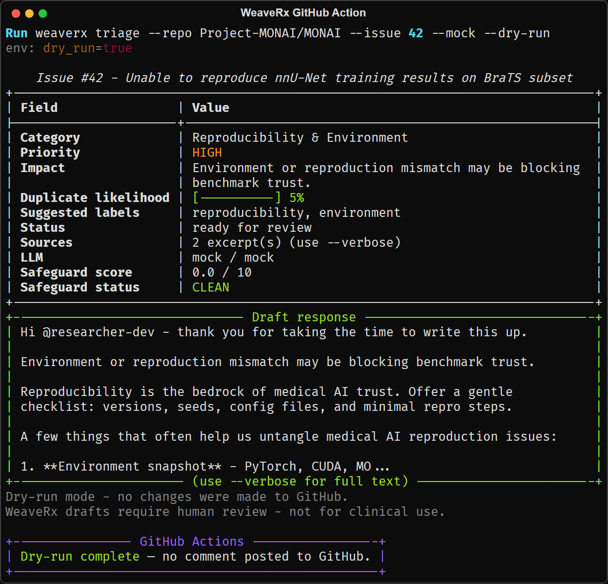

<p align="center">
  
</p>

# WeaveRx

**Medical AI GitHub issue triage with auditable drafts, local safeguards, and human-in-the-loop defaults.**

[](https://pypi.org/project/weaverx/)
[](https://www.python.org/)
[](https://opensource.org/licenses/MIT)
[](https://github.com/FratresMedAI/WeaveRx/actions)
[](https://github.com/FratresMedAI/WeaveRx)

WeaveRx helps maintainers triage issues faster — reproducibility blockers, dataset access, subgroup performance, privacy/DICOM, and clinical validation requests — with **sources** (issue excerpts that grounded the decision) and **safeguard scores** (local heuristics, no extra LLM calls).

Built for medical AI maintainers and research groups who need practical tooling — not a gatekeeper bot.

**Contents:** [Features](#features) · [Quickstart](#quickstart) · [See it in action](#see-it-in-action) · [Installation](#installation) · [Safety](#safety-and-responsible-use) · [Reference](#reference) · [Docs](https://fratresmedai.github.io/WeaveRx/)

---

## Features

- **Domain-tuned** — eight medical AI categories (reproducibility, DICOM/privacy, clinical validation, subgroup performance, and more)
- **Safety by default** — dry-run unless you explicitly post; `--confirm` required for GitHub writes; local safeguard heuristics on every draft
- **Auditable** — `sources` cite issue excerpts; `safeguard` scores are computed locally with no LLM on that path
- **Your LLM stack** — Grok, Anthropic, or OpenAI-compatible endpoints via [LiteLLM](https://github.com/BerriAI/litellm); mock mode for offline CI and demos

Full docs: [Documentation site](https://fratresmedai.github.io/WeaveRx/) · Configuration: [configuration.md](https://fratresmedai.github.io/WeaveRx/configuration/)

---

## Quickstart

Requires Python 3.11+. Environment variables: [configuration.md](https://fratresmedai.github.io/WeaveRx/configuration/).

**One-liner demo:**

```bash
pip install weaverx && weaverx triage --repo Project-MONAI/MONAI --issue 42 --mock
```

### 0. Install

```bash
pip install weaverx
```

See [Installation](#installation) for development setup and the full guide.

### 1. Mock (zero API keys)

```bash
weaverx triage --repo Project-MONAI/MONAI --issue 42 --mock
```

### 2. Dry-run (real GitHub, offline LLM)

```bash
weaverx triage --repo Project-MONAI/MONAI --issue 1234 --mock-llm --dry-run
```

### 3. Real LLM (Grok example)

```bash
export XAI_API_KEY=xai-...
weaverx triage --repo Project-MONAI/MONAI --issue 1234 --dry-run --json
```

More providers: [LLM providers](#llm-providers) · [`examples/llm_provider_examples.md`](examples/llm_provider_examples.md)

### 4. JSON for automation

```bash
weaverx triage --repo Project-MONAI/MONAI --issue 42 --mock --json
```

---

## See it in action

**Command (no API keys):** `weaverx triage --repo Project-MONAI/MONAI --issue 42 --mock`

### Clean triage

<p align="center">
  
</p>

Typical output: reproducibility category, `ready_for_review` status, source excerpts,
`CLEAN` safeguard (0.0/10), and a postable draft in the green panel.

<details>
<summary>Text capture (accessibility / no images)</summary>

See [`examples/captures/triage-clean.txt`](examples/captures/triage-clean.txt).

</details>

### Safeguard warning

Safeguard checks are **advisory** — they flag drafts for review; they never auto-block posting.

<p align="center">
  
</p>

When heuristics fire (e.g. credential-like patterns, heavy repetition), the table shows
**Safeguard flags**, status escalates to `HIGH RISK` / `REVIEW RECOMMENDED`, and the draft
panel border turns yellow or red.

<details>
<summary>Text capture + JSON</summary>

- Text: [`examples/captures/safeguard-warning.txt`](examples/captures/safeguard-warning.txt)
- JSON: [`examples/sample_safeguard_warning.json`](examples/sample_safeguard_warning.json)

</details>

**Try it:** `weaverx triage --repo Project-MONAI/MONAI --issue 42 --mock -v`

<details>
<summary>Example JSON output</summary>

```json
{
  "repo": "Project-MONAI/MONAI",
  "status": "ready_for_review",
  "issue": { "number": 42, "title": "Unable to reproduce nnU-Net training results on BraTS subset" },
  "analysis": { "category": "reproducibility-environment", "priority": "high" },
  "sources": [{ "type": "issue_body", "snippet": "...", "reason": "..." }],
  "draft_response": "Hi @researcher-dev — thank you for documenting this carefully...",
  "safeguard": { "score": 0.0, "status": "clean", "triggered": [] },
  "llm": { "provider": "mock", "model": "mock" },
  "dry_run": true
}
```

Full JSON: [`examples/sample_triage_output.json`](examples/sample_triage_output.json)

</details>

---

## Installation

See the full installation guide: [installation.md](https://fratresmedai.github.io/WeaveRx/installation/)

**Quick install:**

```bash
pip install weaverx
```

Python 3.11+ required.

---

## Safety and responsible use

WeaveRx is **human-in-the-loop** by design. Drafts require maintainer review before posting.

1. **Never paste patient data in GitHub issues.** Privacy flags are heuristic, not guaranteed.
2. **Default is read-only.** Writes need `--post-comment`/`--apply-labels` **and** `--confirm`.
3. **Use `--dry-run`** on repos you don't maintain.
4. **Use `--mock`** in CI and local demos without tokens.
5. **Review safeguard warnings** before posting flagged drafts.

**Not for clinical use** — maintainer support tooling only, not medical advice or a clinical decision system. Does not replace IRB, legal, or compliance review.

Read more: [ETHICS.md](https://github.com/FratresMedAI/WeaveRx/blob/master/ETHICS.md) · [SECURITY.md](https://github.com/FratresMedAI/WeaveRx/blob/master/SECURITY.md) · [SUPPORT.md](https://github.com/FratresMedAI/WeaveRx/blob/master/SUPPORT.md)

---

## GitHub Action

Dry-run triage when issues are opened:

```yaml
- uses: FratresMedAI/WeaveRx@v0.1.2
  with:
    repo: ${{ github.repository }}
    issue_number: ${{ github.event.issue.number }}
    dry_run: "true"
    llm_provider: "grok"
  env:
    XAI_API_KEY: ${{ secrets.XAI_API_KEY }}
```

<p align="center">
  
</p>

See [`action.yml`](action.yml) and [`.github/workflows/triage-on-issue.yml`](.github/workflows/triage-on-issue.yml).

---

## Reference

<details>
<summary><strong>LLM providers</strong></summary>

| Provider | CLI | API key env | Default model |
|---|---|---|---|
| Grok | `--llm-provider grok` | `XAI_API_KEY` | `xai/grok-2-latest` |
| Anthropic | `--llm-provider anthropic` | `ANTHROPIC_API_KEY` | `anthropic/claude-3-5-sonnet-20241022` |
| OpenAI-compatible | `--llm-provider openai` | `OPENAI_API_KEY` | `openai/gpt-4o` |

Override: `WEAVERX_LLM_MODEL`, `WEAVERX_LLM_PROVIDER`. Details: [llm-providers.md](https://fratresmedai.github.io/WeaveRx/reference/llm-providers/)

</details>

<details>
<summary><strong>Medical AI categories</strong></summary>

| Category | What we look for |
|---|---|
| **Dataset Access & Licensing** | Download links, usage terms, attribution |
| **Model Performance (Pathology/Subgroup)** | Accuracy on specific diseases or patient groups |
| **Reproducibility & Environment** | MONAI/nnU-Net versions, CUDA/PyTorch, can't reproduce results |
| **Clinical Validation Request** | External validation, reader studies, deployment |
| **Privacy/Compliance/DICOM** | PHI, de-identification, HIPAA/GDPR, DICOM metadata |
| **Bug** | Crashes, incorrect outputs |
| **Feature/Integration Request** | New capabilities, framework hooks |
| **Documentation** | Missing or unclear tutorials and API docs |

Full table: [categories.md](https://fratresmedai.github.io/WeaveRx/reference/categories/)

</details>

<details>
<summary><strong>Draft safeguards</strong></summary>

Local-only checks after every draft — **advisory**, never auto-block posting. See [Safeguard warning](#safeguard-warning) above.

| Score | Status | Meaning |
|---|---|---|
| 0.0 – 2.9 | `clean` | No meaningful red flags |
| 3.0 – 6.9 | `review_recommended` | Skim draft before posting |
| 7.0 – 10.0 | `high_risk` | Multiple or severe heuristics fired |

Full reference: [safeguards.md](https://fratresmedai.github.io/WeaveRx/reference/safeguards/)

</details>

<details>
<summary><strong>CLI reference</strong></summary>

```
weaverx triage --repo owner/repo [--issue N | --recent N] [options]
```

Key flags: `--mock`, `--dry-run`, `--json`, `--llm-provider`, `--confirm`, `--post-comment`, `--safeguards`

Full reference: [cli.md](https://fratresmedai.github.io/WeaveRx/reference/cli/)

</details>

---

## Related projects

- [MONAI](https://github.com/Project-MONAI/MONAI) — open-source medical AI framework
- [nnU-Net](https://github.com/MIC-DKFZ/nnUNet) — self-configuring segmentation
- [LiteLLM](https://github.com/BerriAI/litellm) — unified LLM API (used by WeaveRx)
- [Safire](https://github.com/FratresMedAI/Safire) — related audit tooling from the same org

---

## Citing WeaveRx

If you use WeaveRx in research or evaluations, cite via [`CITATION.cff`](CITATION.cff) (GitHub can generate a BibTeX entry from that file).

---

## Roadmap (near-term)

1. **Embedding-based duplicate detection** — optional `weaverx[embeddings]` extra
2. **PR triage mode** — `--pr` for pull request review drafts
3. **Expanded provider presets** — more medical-AI-tuned prompt templates

See [CHANGELOG.md](CHANGELOG.md) for release history.

---

## Development and contributing

```bash
pip install -e ".[dev]"
pre-commit install
ruff check .
mypy src/weaverx
pytest -m "not network" --cov=weaverx
```

[CONTRIBUTING.md](https://github.com/FratresMedAI/WeaveRx/blob/master/CONTRIBUTING.md) · [CODE_OF_CONDUCT.md](https://github.com/FratresMedAI/WeaveRx/blob/master/CODE_OF_CONDUCT.md) · [releasing.md](https://fratresmedai.github.io/WeaveRx/releasing/)

---

## License

MIT — see [`LICENSE`](LICENSE).
