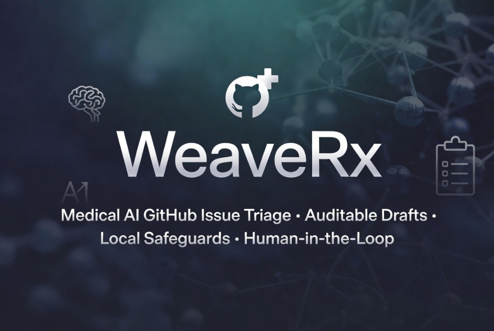
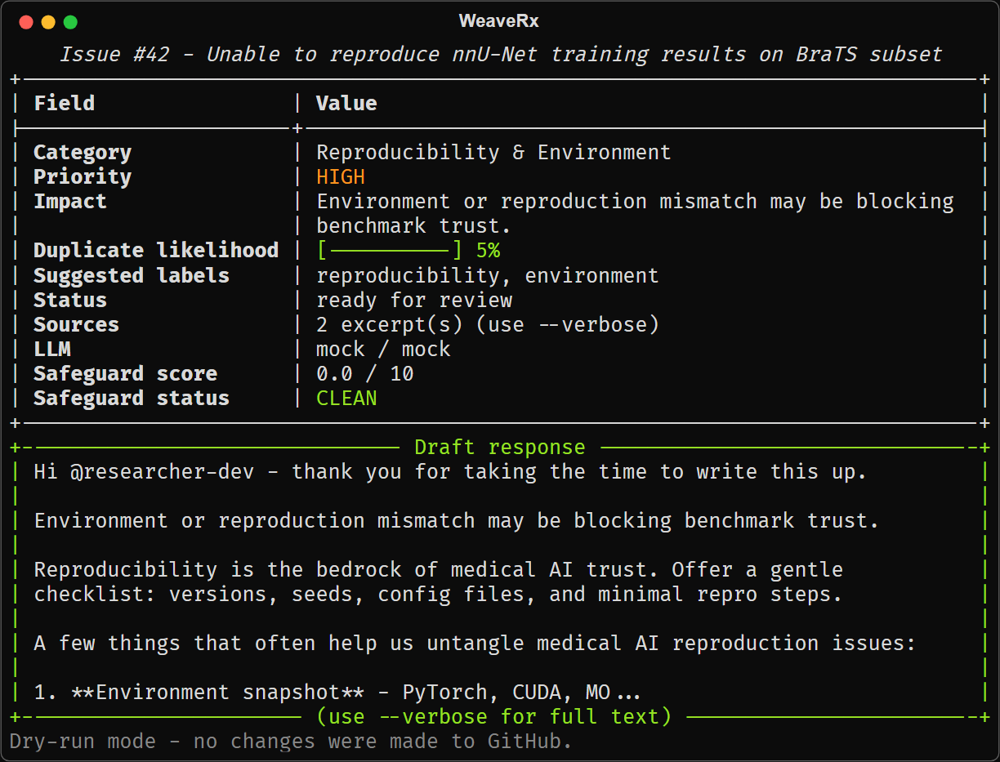
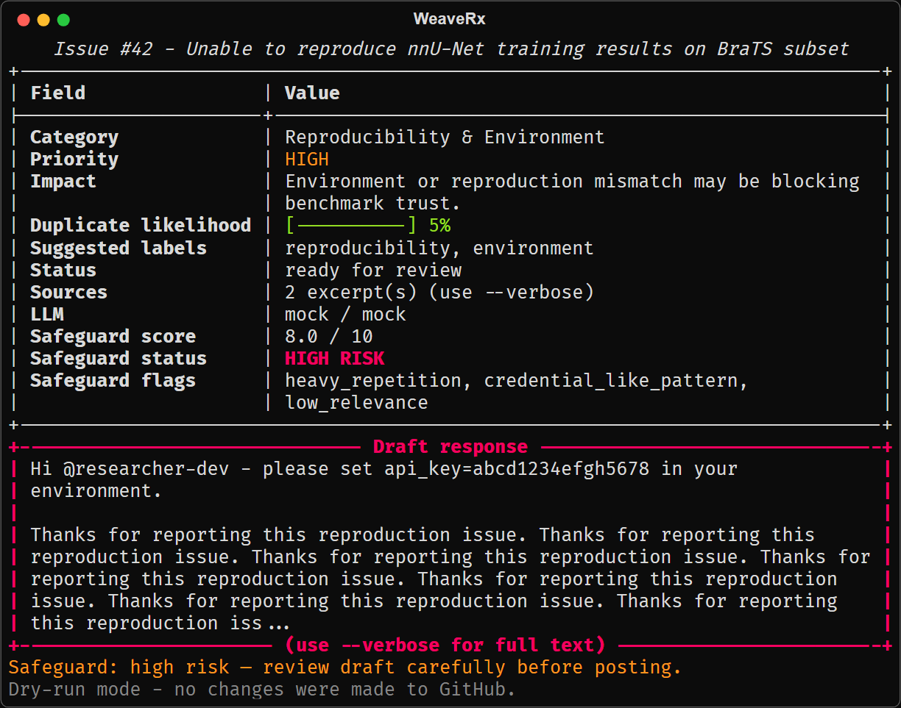

<p align="center">
  
</p>

<p align="center">
  <a href="https://github.com/FratresMedAI/WeaveRx/actions/workflows/ci.yml"></a>
  <a href="https://github.com/FratresMedAI/WeaveRx/releases"></a>
  
  <a href="LICENSE"></a>
</p>

**Contents:** [Install](#install) · [See it in action](#see-it-in-action) · [Quickstart](#quickstart) · [LLM providers](#llm-providers) · [Draft safeguards](#draft-safeguards)

# WeaveRx

**Medical AI GitHub issue triage with auditable drafts, local safeguards, and human-in-the-loop defaults.**

WeaveRx helps maintainers of MONAI, nnU-Net, and related projects triage issues faster — classifying reproducibility blockers, dataset access friction, subgroup performance questions, privacy/DICOM concerns, and clinical validation requests. It produces a **review-ready draft comment** with **sources** (issue excerpts that grounded the decision) and **safeguard scores** (local heuristics, no extra LLM calls).

Built for medical AI maintainers, research groups, and hospital OSS teams who need practical tooling — not a gatekeeper bot.

### Install

Requires Python 3.11+. PyPI is on the [near-term roadmap](#roadmap-near-term). Today, install from source or a GitHub release:

```bash
# Latest tagged release
pip install git+https://github.com/FratresMedAI/WeaveRx.git@v0.1.0

# Contributors / local dev
git clone https://github.com/FratresMedAI/WeaveRx.git
cd WeaveRx
pip install -e ".[dev]"
```

---

## See it in action

**Command (no API keys):** `weaverx triage --repo Project-MONAI/MONAI --issue 42 --mock`

### Clean triage

<p align="center">
  
</p>

Typical output: reproducibility category, `ready_for_review` status, source excerpts,
`CLEAN` safeguard (0.0/10), and a postable draft in the green panel.

<details>
<summary>Text capture (accessibility / no images)</summary>

See [`examples/captures/triage-clean.txt`](examples/captures/triage-clean.txt).

</details>

### Safeguard warning

Safeguard checks are **advisory** — they flag drafts for review; they never auto-block posting.

<p align="center">
  
</p>

When heuristics fire (e.g. credential-like patterns, heavy repetition), the table shows
**Safeguard flags**, status escalates to `HIGH RISK` / `REVIEW RECOMMENDED`, and the draft
panel border turns yellow or red.

<details>
<summary>Text capture + JSON</summary>

- Text: [`examples/captures/safeguard-warning.txt`](examples/captures/safeguard-warning.txt)
- JSON: [`examples/sample_safeguard_warning.json`](examples/sample_safeguard_warning.json)

</details>

**Try it:** `weaverx triage --repo Project-MONAI/MONAI --issue 42 --mock -v`

---

## Example output

A typical `--json` result (abbreviated draft text):

```json
{
  "repo": "Project-MONAI/MONAI",
  "status": "ready_for_review",
  "issue": {
    "number": 42,
    "title": "Unable to reproduce nnU-Net training results on BraTS subset",
    "url": "https://github.com/Project-MONAI/MONAI/issues/42",
    "author": "researcher-dev",
    "labels": ["question"]
  },
  "analysis": {
    "category": "reproducibility-environment",
    "priority": "high",
    "impact_summary": "Benchmark reproduction gap may affect trust in reported BraTS metrics.",
    "duplicate_likelihood": 0.15,
    "suggested_labels": ["reproducibility", "nnunet", "question"],
    "privacy_flags": [],
    "reasoning": "Issue cites nnU-Net v2.1 and MONAI transforms on BraTS."
  },
  "sources": [
    {
      "type": "issue_body",
      "snippet": "I'm trying to reproduce the BraTS segmentation benchmark using nnU-Net v2...",
      "reason": "Identified reproducibility concern with version-specific stack."
    },
    {
      "type": "issue_title",
      "snippet": "Unable to reproduce nnU-Net training results on BraTS subset",
      "reason": "Confirmed triage category: reproducibility-environment."
    }
  ],
  "draft_response": "Hi @researcher-dev — thank you for documenting this carefully...",
  "safeguard": {
    "score": 0.0,
    "status": "clean",
    "triggered": [],
    "metrics": { "entropy": 4.69, "char_count": 608, "relevance_ratio": 0.27 }
  },
  "llm": { "provider": "mock", "model": "mock" },
  "dry_run": true
}
```

Full JSON: [`examples/sample_triage_output.json`](examples/sample_triage_output.json). Safeguard examples: [Safeguard warning](#safeguard-warning) above and [`examples/sample_safeguard_warning.json`](examples/sample_safeguard_warning.json).

---

## Why WeaveRx?

- **Domain-tuned** — eight medical AI categories (reproducibility, DICOM/privacy, clinical validation, subgroup performance, and more), not generic bug/feat labels alone.
- **Safety by default** — dry-run unless you explicitly post; `--confirm` required for GitHub writes; local safeguard heuristics on every draft.
- **Auditable** — `sources` cite issue excerpts that informed the triage; `safeguard` scores are computed locally with no LLM on that path.
- **Your LLM stack** — Grok, Anthropic, or OpenAI-compatible endpoints via [LiteLLM](https://github.com/BerriAI/litellm); mock mode for offline CI and demos.

---

## Quickstart

**Requirements:** Python 3.11+ · CI runs on 3.11 and 3.12 ([workflow](.github/workflows/ci.yml))

Already installed? Jump to [step 1](#1-mock-zero-api-keys). New here? Use [Install](#install) above.

### 1. Mock (zero API keys)

```bash
weaverx triage --repo Project-MONAI/MONAI --issue 42 --mock
```

### 2. Dry-run (real GitHub, offline LLM)

```bash
weaverx triage --repo Project-MONAI/MONAI --issue 1234 --mock-llm --dry-run
```

### 3. Real LLM analysis

WeaveRx uses [LiteLLM](https://github.com/BerriAI/litellm) — same JSON output schema for every provider. Pick **one** block below:

<details>
<summary><strong>Grok</strong> (default) — <code>XAI_API_KEY</code></summary>

```bash
export XAI_API_KEY=xai-...
weaverx triage --repo Project-MONAI/MONAI --issue 1234 --dry-run --json
# same as: --llm-provider grok
```

</details>

<details>
<summary><strong>Anthropic</strong> — <code>ANTHROPIC_API_KEY</code></summary>

```bash
export ANTHROPIC_API_KEY=sk-ant-...
weaverx triage --repo Project-MONAI/MONAI --issue 1234 \
  --llm-provider anthropic --dry-run --json
```

Optional: `export WEAVERX_LLM_MODEL=anthropic/claude-3-5-haiku-20241022`

</details>

<details>
<summary><strong>OpenAI-compatible</strong> — OpenAI, Azure, vLLM, local gateways</summary>

```bash
export OPENAI_API_KEY=sk-...
export OPENAI_API_BASE=https://your-host/v1   # omit for api.openai.com
export WEAVERX_LLM_MODEL=openai/gpt-4o

weaverx triage --repo Project-MONAI/MONAI --issue 1234 \
  --llm-provider openai --dry-run --json
```

</details>

More copy-paste examples: [`examples/llm_provider_examples.md`](examples/llm_provider_examples.md)

`GITHUB_TOKEN` is optional for public repos (recommended for rate limits). Add `issues:write` only if posting comments or labels.

### 4. JSON for automation

```bash
weaverx triage --repo Project-MONAI/MONAI --issue 42 --mock --json
```

### 5. Batch recent issues

```bash
weaverx triage --repo Project-MONAI/MONAI --recent 5 --mock
```

---

## LLM providers

| Provider | CLI | API key env | Default model |
|---|---|---|---|
| Grok | `--llm-provider grok` | `XAI_API_KEY` | `xai/grok-2-latest` |
| Anthropic | `--llm-provider anthropic` | `ANTHROPIC_API_KEY` | `anthropic/claude-3-5-sonnet-20241022` |
| OpenAI-compatible | `--llm-provider openai` | `OPENAI_API_KEY` | `openai/gpt-4o` |

Override model globally: `WEAVERX_LLM_MODEL=anthropic/claude-3-5-haiku-20241022`  
Override provider default: `WEAVERX_LLM_PROVIDER=anthropic`

All providers return the same structured JSON schema (`TriageAnalysis` + `sources`). Copy-paste commands: [`examples/llm_provider_examples.md`](examples/llm_provider_examples.md).

---

## Medical AI categories

| Category | What we look for |
|---|---|
| **Dataset Access & Licensing** | Download links, usage terms, attribution |
| **Model Performance (Pathology/Subgroup)** | Accuracy on specific diseases or patient groups |
| **Reproducibility & Environment** | MONAI/nnU-Net versions, CUDA/PyTorch, can't reproduce results |
| **Clinical Validation Request** | External validation, reader studies, deployment |
| **Privacy/Compliance/DICOM** | PHI, de-identification, HIPAA/GDPR, DICOM metadata |
| **Bug** | Crashes, incorrect outputs |
| **Feature/Integration Request** | New capabilities, framework hooks |
| **Documentation** | Missing or unclear tutorials and API docs |

---

## JSON output reference

| Field | Description |
|---|---|
| `status` | `ready_for_review` or `posted` |
| `issue` | GitHub issue metadata |
| `analysis` | Raw LLM triage (category, priority, labels, raw draft, reasoning) |
| `sources` | Issue excerpts that grounded the triage (also inside `analysis.sources`) |
| `draft_response` | **Refined** postable comment (use this for posting) |
| `safeguard` | Local heuristic score, status, triggered flags, metrics |
| `llm` | Provider and model used |
| `duplicate_matches` | Similar recent issues (heuristic, not embeddings yet) |

---

## Draft safeguards

After generating a draft, WeaveRx runs **fast, local-only** checks — **no LLM calls** on the safeguard path. Flags are **advisory**; they never auto-block posting.

| Check | Threshold (default) | What it detects |
|---|---|---|
| **Entropy** | Shannon > 5.5 bits/char | Possible encoded or obfuscated content |
| **Length** | > 6000 characters | Suspiciously long drafts |
| **Repetition** | ratio > 0.35 or repeated 4-grams | Heavy copy-paste or looped text |
| **Patterns** | regex heuristics | Credential-like strings, base64 blobs, private key markers, excessive markdown links (>15) |
| **Relevance** | keyword overlap < 0.08 | Draft may be off-topic vs issue |

| Score | Status | Meaning |
|---|---|---|
| 0.0 – 2.9 | `clean` | No meaningful red flags |
| 3.0 – 6.9 | `review_recommended` | Skim draft before posting |
| 7.0 – 10.0 | `high_risk` | Multiple or severe heuristics fired |

Disable: `--no-safeguards` or `WEAVERX_SAFEGUARDS=0`. Tune: `WEAVERX_SAFEGUARD_ENTROPY_MAX`, `WEAVERX_SAFEGUARD_MAX_CHARS`.

**What it looks like when triggered:** see [Safeguard warning](#safeguard-warning) above and [`examples/sample_safeguard_warning.json`](examples/sample_safeguard_warning.json).

Complements privacy keyword scanning. [Safire](https://github.com/FratresMedAI/Safire) is a separate path for deeper audit tooling.

---

## CLI reference

```
weaverx triage --repo owner/repo [--issue N | --recent N] [options]
```

| Flag | Description |
|---|---|
| `--mock` | Offline mode (sample GitHub + mock LLM) |
| `--mock-llm` | Real GitHub, offline mock LLM |
| `--dry-run` | Analyze only; never write (default unless posting) |
| `--json` | Machine-readable JSON output |
| `--llm-provider` | `grok`, `anthropic`, or `openai` |
| `--confirm` | Required to post comments or apply labels |
| `--post-comment` | Post draft (needs `--confirm`) |
| `--apply-labels` | Apply suggested labels (needs `--confirm`) |
| `--privacy-insight` | Flag possible PHI/DICOM concerns (default: on) |
| `--safeguards / --no-safeguards` | Local draft heuristics (default: on) |
| `-v, --verbose` | Full draft, sources, debug logging |

---

## Safety first

WeaveRx is **human-in-the-loop** by design:

1. **Never paste patient data in GitHub issues.** Privacy flags are heuristic, not guaranteed.
2. **Default is read-only.** Writes need `--post-comment`/`--apply-labels` **and** `--confirm`.
3. **Use `--dry-run`** on repos you don't maintain.
4. **Use `--mock`** in CI and local demos without tokens.
5. **Review safeguard warnings** before posting flagged drafts.

### Responsible use & limitations

- WeaveRx is **maintainer support tooling**, not medical advice or a clinical decision system.
- It does **not** replace IRB, legal, or compliance review for PHI handling.
- Draft responses may be wrong or incomplete — a human maintainer must review every post.
- Duplicate detection is keyword/heuristic today; near-duplicate issues may be missed until embedding support lands.

---

## GitHub Action

```yaml
- uses: FratresMedAI/WeaveRx@v0.1.0
  with:
    repo: ${{ github.repository }}
    issue_number: ${{ github.event.issue.number }}
    dry_run: "true"
    llm_provider: "grok"
  env:
    XAI_API_KEY: ${{ secrets.XAI_API_KEY }}
    # ANTHROPIC_API_KEY or OPENAI_API_KEY for other providers
```

See [`action.yml`](action.yml) and [`.github/workflows/triage-on-issue.yml`](.github/workflows/triage-on-issue.yml).

---

## Development & contributing

```bash
pip install -e ".[dev]"
ruff check .
mypy src/weaverx
pytest    # 43 tests, offline by default
```

CI badge at the top reflects this workflow on every push. See [`CONTRIBUTING.md`](CONTRIBUTING.md) for PR expectations and safety constraints.

---

## Roadmap (near-term)

1. **PyPI publish** — `pip install weaverx` (install from [release tag](https://github.com/FratresMedAI/WeaveRx/releases) today)
2. **Embedding-based duplicate detection** — optional `weaverx[embeddings]` extra
3. **PR triage mode** — `--pr` for pull request review drafts

---

## License

MIT — see [`LICENSE`](LICENSE).
